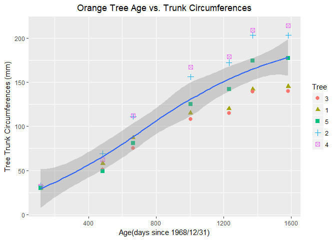
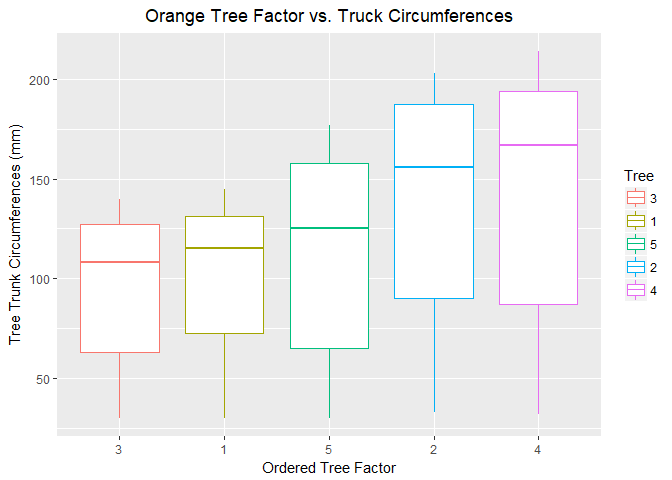
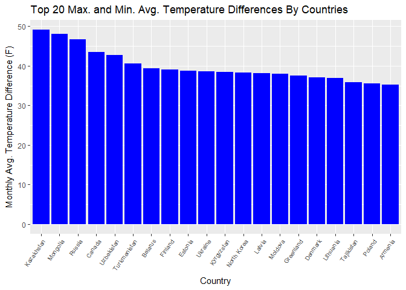
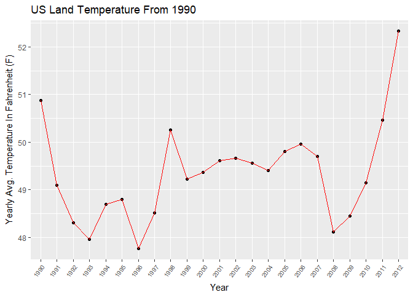
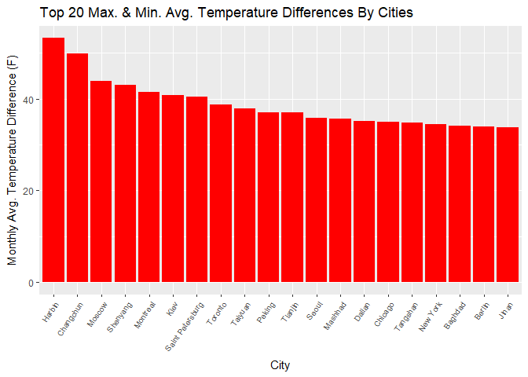
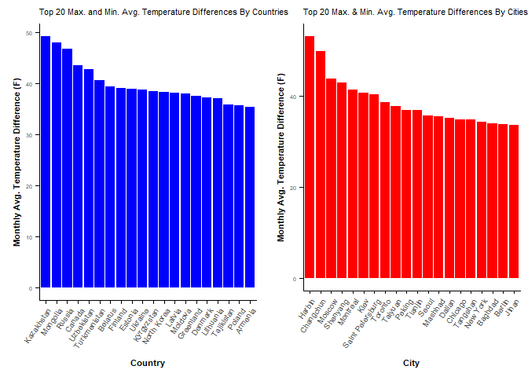

Analysis.md
================
Cam Lu, Festus Yeboah, Chris Havenstein
August 20, 2017

Overview to Analysis.md
=======================

This file, Analysis.md, includes the analysis of two different questions. Each question has included sub-questions. The questions came from the "casestudy2.pdf" provided by Dr. Jongwook Woo. Last, "Analysis.md" contains a conclusion.

-   **Question 2: Orange data analysis**
    -   Step (a), calculate the mean and median trunk circumferences for different size of trees.
    -   Step (b), make a scatter plot of the trunk ciercumferences against the age of the tree. Use different plotting symbols.
    -   Step (c), Display the trunk circumferences on a comparative boxplot against tree. Be sure to order the boxplots in the increasing order of maximum diameter.
-   **Question 3: Country, US temperature, and city temperature data analysis**
    -   First, **(i)** find the difference between the maximum and the minimum monthly average temperatures for each country and report/visualize the top 20 countries with the maximum differences for the period since 1900.
    -   Second, **(ii)** select a subset of data called “UStemp” with US land temperatures from 01/01/1990 in the Temp dataset. Use the UStemp dataset to answer the following: **(a)** Create a new column to display the monthly average land temperatures in Fahrenheit (°F). **(b)** Calculate average land temperature by year and plot it. The original file has the average land temperature by month. **(c)** Calculate the one year difference of average land temperature by year and provide the maximum difference (value) with corresponding two years.
    -   Third, **(iii)** download “CityTemp” data set at box.com. Find the difference between the maximum and the minimum temperatures for each major city and report/visualize top 20 cities with maximum differences for the period since 1900.
    -   Last, **(iv)** compare the two graphs in **(i)** and **(iii)** and comment it.
-   Conclusion:
    -   Our closing thoughts are included in this section.

Question 2. Orange data analysis
================================

### Gathering and Cleaning the Data

First, we began by sourcing the two files that gather and clean the data for analysis. These files are **Gather.R** and **TidyData.R.**

``` r
source("Gather.R")
source("TidyData.R")
```

### Orange Data Variable Descriptions

-   These descriptions came from the original "casestudy2.pdf" document.

<table style="width:94%;">
<colgroup>
<col width="20%" />
<col width="73%" />
</colgroup>
<thead>
<tr class="header">
<th>Variable</th>
<th>Description</th>
</tr>
</thead>
<tbody>
<tr class="odd">
<td>Tree</td>
<td>an ordered factor indicating the tree on which the measurement is made. The ordering is according to increasing maximum diameter.</td>
</tr>
<tr class="even">
<td>Age</td>
<td>a numeric vector giving the age of the tree (days since 1968/12/31)</td>
</tr>
<tr class="odd">
<td>circumference</td>
<td>a numeric vector of trunk circumferences (mm). This is probably “circumference at breast height”, a standard measurement in forestry</td>
</tr>
</tbody>
</table>

### Question 2, step (a) - Mean and Median Trunk Circumferences by Tree Groups

First, we were required to calculate the mean and median of the each tree group. We used the "doBy" package to summarize the data. The "doBy" package is loaded below and you can see a sample of the data.

``` r
library(doBy)
head(Orange)
```

    ##   Tree  age circumference
    ## 1    1  118            30
    ## 2    1  484            58
    ## 3    1  664            87
    ## 4    1 1004           115
    ## 5    1 1231           120
    ## 6    1 1372           142

Below, we provide the mean and the median of the trunk circumferences for different size of the trees. Note the "summaryBy" function from the "doBy" package.

``` r
options(width =120)
summaryBy(circumference~Tree, data = Orange, FUN = c(mean, median, max, min))
```

    ##   Tree circumference.mean circumference.median circumference.max circumference.min
    ## 1    3           94.00000                  108               140                30
    ## 2    1           99.57143                  115               145                30
    ## 3    5          111.14286                  125               177                30
    ## 4    2          135.28571                  156               203                33
    ## 5    4          139.28571                  167               214                32

### Question 2, step (b) - Scatter Plot of Trunk Circumference Against Age by Tree Groups

The "ggplot2" package was used to create the scatter plot.

``` r
library(ggplot2)
o <- ggplot(data = Orange, aes(age, circumference))
o + geom_point(aes(color = Tree, shape = Tree), size = 2.5) + geom_smooth() + labs(x = "Age(days since 1968/12/31)", y = "Tree Trunk Circumferences (mm)", title = "Orange Tree Age vs. Trunk Circumferences") +   theme(plot.title = element_text(hjust = 0.5))
```

    ## `geom_smooth()` using method = 'loess'



-   The scatter plot above suggests a positive relationship between age of trees (in each group) and trunk circumfrences independent of tree factor (i.e. group) of 3, 1, 5, 2, 4. It is worth mentioning that these groups are sorted in order of increasing mean circumference. There seems to be more variation between tree groups as age increases. For example, each group of tree has approximately the same tree trunk circumference when the trees have an age of 50 days. However, maximum tree trunk circumferences vary greatly between each tree group by 1600 days of age.

### Question 2, step (c) - Boxplot of Trunk Circumferences by Tree Group

-   The question requests that the boxplot has each tree group ordered in terms of increasing order of maximum diameter. The boxplot below is ordered by tree group with the same order suggested in question 2, step (b). Intuitively, trees with larger circumferences will have larger diameters, but we proved the order of tree groups is the same, below.

``` r
#first we need to convert the circumferences to diameters, to add a new column called diameter

#Diameter = Circumference/pi
Orange$Diameter <- Orange$circumference/pi

#Show that the scatterplot is ordered in increasing order of diameter by tree group
DiameterSummary <- summaryBy(Diameter~Tree, data = Orange, FUN = c(mean, median, max, min))
DiameterSummary
```

    ##   Tree Diameter.mean Diameter.median Diameter.max Diameter.min
    ## 1    3      29.92113        34.37747     44.56338     9.549297
    ## 2    1      31.69457        36.60564     46.15493     9.549297
    ## 3    5      35.37787        39.78874     56.34085     9.549297
    ## 4    2      43.06278        49.65634     64.61691    10.504226
    ## 5    4      44.33602        53.15775     68.11832    10.185916

``` r
#Tree group 3 has the lowest max diameter, followed by, 1, 5, 2, and 4.

g <- ggplot(data = Orange, aes(Tree, circumference))
g + geom_boxplot(aes(color = Tree)) + labs(x = "Ordered Tree Factor", y = "Tree Trunk Circumferences (mm)", title = "Orange Tree Factor vs. Truck Circumferences") + theme(plot.title = element_text(hjust = 0.5))
```



Question 3: Country, US temperature, and city temperature data analysis
=======================================================================

Before answering the first part of this analysis question, please refer to the variable descriptions for the "Temp" data set, below.

### Temp Data Variable Descriptions

| Variable                        | Description                                      |
|---------------------------------|--------------------------------------------------|
| Date                            | The date of average monthly temperatures measure |
| Monthly.AverageTemp             | The monthly average temperature                  |
| Monthly.AverageTemp.Uncertainty | The monthly temperature variation.               |
| Country                         | The country of monthly temperature is taken      |

### Question 3, part (i) - Top 20 Differences Between Maximum and Minimum Monthly Average Temperatures, by Country.

-   To analyze these differences in monthly average temperatures by countries, Cam Lu created a function to find the difference between the maximum and minimum values in the "Temp" data set. When combining this function with the "summaryBy" function from the "doBy" package, this allowed us to quickly find the maximum and minimum monthly average temperature differences by country.

-   After finding these differences by country, we visualized the top 20 differences by country by using the "ggplot2" package to create a bar chart.

``` r
head(temp)
```

    ##         Date Monthly.AverageTemp Monthly.AverageTemp.Uncertainty     Country
    ## 1 1838-04-01              13.008                           2.586 Afghanistan
    ## 2 1838-05-01                  NA                              NA Afghanistan
    ## 3 1838-06-01              23.950                           2.510 Afghanistan
    ## 4 1838-07-01              26.877                           2.883 Afghanistan
    ## 5 1838-08-01              24.938                           2.992 Afghanistan
    ## 6 1838-09-01              18.981                           2.538 Afghanistan

``` r
myfun <- function(x){c((max(x, na.rm = TRUE)-min(x, na.rm = TRUE)), max(x, na.rm = TRUE), min(x, na.rm = TRUE))}
tempDiff <- summaryBy(Monthly.AverageTemp~Country, data = temp1900, FUN = myfun, fun.names = c("MaxMinDifference", "Max", "Min"))
tempDiffTop20 <- head(tempDiff[order(tempDiff$Monthly.AverageTemp.MaxMinDifference, decreasing = TRUE),], 20)
#update the index on the first column
rownames(tempDiffTop20) <- 1:nrow(tempDiffTop20)
tempDiffTop20
```

    ##         Country Monthly.AverageTemp.MaxMinDifference Monthly.AverageTemp.Max Monthly.AverageTemp.Min
    ## 1    Kazakhstan                               49.163                  25.562                 -23.601
    ## 2      Mongolia                               48.010                  20.716                 -27.294
    ## 3        Russia                               46.682                  16.893                 -29.789
    ## 4        Canada                               43.532                  14.796                 -28.736
    ## 5    Uzbekistan                               42.698                  30.375                 -12.323
    ## 6  Turkmenistan                               40.579                  32.136                  -8.443
    ## 7       Belarus                               39.338                  22.811                 -16.527
    ## 8       Finland                               39.068                  18.967                 -20.101
    ## 9       Estonia                               38.815                  22.332                 -16.483
    ## 10      Ukraine                               38.660                  23.936                 -14.724
    ## 11   Kyrgyzstan                               38.436                  19.275                 -19.161
    ## 12  North Korea                               38.342                  23.952                 -14.390
    ## 13       Latvia                               38.063                  22.279                 -15.784
    ## 14      Moldova                               38.012                  25.231                 -12.781
    ## 15    Greenland                               37.516                   0.339                 -37.177
    ## 16      Denmark                               37.138                   0.699                 -36.439
    ## 17    Lithuania                               36.970                  21.791                 -15.179
    ## 18   Tajikistan                               35.829                  19.363                 -16.466
    ## 19       Poland                               35.616                  22.509                 -13.107
    ## 20      Armenia                               35.273                  25.291                  -9.982

``` r
#create the bar chart in ggplot2
g  <- ggplot(tempDiffTop20, aes(x = reorder(Country, -Monthly.AverageTemp.MaxMinDifference), y= tempDiffTop20$Monthly.AverageTemp.MaxMinDifference))
g1 <- g + geom_bar(stat = "identity", fill="blue") + theme(axis.text.x = element_text(size = 7.5, angle = 55, hjust = 1)) +  xlab("Country") + ylab("Monthly Avg. Temperature Difference (F)") + ggtitle("Top 20 Max. and Min. Avg. Temperature Differences By Countries")
g1
```



### Question 3, part (ii) - "USTemp" Subset From "Temp" Data Set, since 1990

The "Temp" data set was used to create a subset of the country temperature data, where the country was "United States" and only containing values since 1990.

This question has three sub-questions.

#### Question 3, part (ii), sub-question (a) - Create Monthly Average Temperature Column in Fahrenheit

-   To quickly and accurately convert the "Monthly.AverageTemp" column to fahrenheit (from celsuis), we used the "weathermetrics" package.

-   The first 6 rows containing the new column "Monthly.AverageTemp.Fahrenheit" are provided below. Please note the new column was added as the last column in the dataset (possibly requiring you to scroll to the right).

``` r
##Enable the weathermetrics package to convert temperature from Celsius to Fahrenheit
##Need to run install.packages(“weathermetrics") to install package first if have not.

library(weathermetrics)

##Create a new column to display the monthly average land temperatures in Fahrenheit (°F). 

UStemp$Monthly.AverageTemp.Fahrenheit <- celsius.to.fahrenheit(UStemp$Monthly.AverageTemp)
head(UStemp)
```

    ##              Date Monthly.AverageTemp Monthly.AverageTemp.Uncertainty       Country Year Monthly.AverageTemp.Fahrenheit
    ## 554299 1990-02-01              -1.747                           0.107 United States 1990                          28.86
    ## 554300 1990-03-01               4.465                           0.240 United States 1990                          40.04
    ## 554301 1990-04-01               9.380                           0.080 United States 1990                          48.88
    ## 554302 1990-05-01              13.772                           0.112 United States 1990                          56.79
    ## 554303 1990-06-01              19.780                           0.255 United States 1990                          67.60
    ## 554304 1990-07-01              21.605                           0.175 United States 1990                          70.89

#### Question 3, part (ii), sub-question (b) - Time Series plot of US Average Land Temperatures by Year

-   To provide the time series plot of the US average land temperatures by year, we had to aggregated the monthly data by year. The "aggregate" function was used below to do this. The yearly aggregated values were stored in the dataframe "YearlyAverageTemp".

-   Then, the plot was created by using "ggplot2".

``` r
##Calculate average temperature for each year.
options(digits=5)
YearlyAverageTemp <- aggregate(UStemp[, 6], list(UStemp$Year), mean, na.rm = TRUE)
names(YearlyAverageTemp) <- c("Year", "Average.Temp")
YearlyAverageTemp
```

    ##    Year Average.Temp
    ## 1  1990       50.881
    ## 2  1991       49.088
    ## 3  1992       48.302
    ## 4  1993       47.960
    ## 5  1994       48.687
    ## 6  1995       48.795
    ## 7  1996       47.757
    ## 8  1997       48.510
    ## 9  1998       50.255
    ## 10 1999       49.219
    ## 11 2000       49.367
    ## 12 2001       49.614
    ## 13 2002       49.668
    ## 14 2003       49.560
    ## 15 2004       49.401
    ## 16 2005       49.807
    ## 17 2006       49.954
    ## 18 2007       49.707
    ## 19 2008       48.113
    ## 20 2009       48.446
    ## 21 2010       49.150
    ## 22 2011       50.469
    ## 23 2012       52.334

``` r
p <- ggplot(data = YearlyAverageTemp, aes(Year, Average.Temp, group = 1))
p + geom_point() + geom_line(color = 'red') + labs(y = "Yearly Avg. Temperature In Fahrenheit (F)", 
                                                   title = "US Land Temperature From 1990") +
                                        theme(axis.text.x = element_text(size = 7.5, angle = 55, hjust = 1))
```



#### Question 3, part (ii), sub-question (c) - One Year Differences of US Average Land Temperatures

-   To create the one year differences of US average land temperatures, we added a new column to our YearlyAverageTemp dataframe called "DiffTempFromPreviousYear".

-   The results are displayed, below. Please note that the year "1990" has a "NA" value. This is because there wasn't a previous year in the "USTemp" subset before 1990.

``` r
YearlyDiffTemp<-round(diff(YearlyAverageTemp$Average.Temp), 3)
YearlyAverageTemp$DiffTempFromPreviousYear <- c("NA", YearlyDiffTemp)
YearlyAverageTemp
```

    ##    Year Average.Temp DiffTempFromPreviousYear
    ## 1  1990       50.881                       NA
    ## 2  1991       49.088                   -1.793
    ## 3  1992       48.302                   -0.787
    ## 4  1993       47.960                   -0.342
    ## 5  1994       48.687                    0.727
    ## 6  1995       48.795                    0.108
    ## 7  1996       47.757                   -1.038
    ## 8  1997       48.510                    0.753
    ## 9  1998       50.255                    1.745
    ## 10 1999       49.219                   -1.036
    ## 11 2000       49.367                    0.148
    ## 12 2001       49.614                    0.247
    ## 13 2002       49.668                    0.053
    ## 14 2003       49.560                   -0.108
    ## 15 2004       49.401                   -0.159
    ## 16 2005       49.807                    0.406
    ## 17 2006       49.954                    0.148
    ## 18 2007       49.707                   -0.248
    ## 19 2008       48.113                   -1.593
    ## 20 2009       48.446                    0.332
    ## 21 2010       49.150                    0.704
    ## 22 2011       50.469                     1.32
    ## 23 2012       52.334                    1.865

### Question 3, part (iii) - "CityTemp" Top 20 Differences Between Maximum and Minimum Monthly Average Temperatures, by Major Cities

-   To analyze these differences in monthly average temperatures by major cities, we reused Cam Lu's function to find the difference between the maximum and minimum values in the "CityTemp" data set. When combining this function with the "summaryBy" function from the "doBy" package, this allowed us to quickly find the maximum and minimum monthly average temperature differences by major cities.

-   After finding these differences by country, we visualized the top 20 differences by country by using the "ggplot2" package to create a bar chart.

``` r
head(CityTemp1900)
```

    ##           Date Monthly.AverageTemp Monthly.AverageTemp.Uncertainty        City  Country Latitude Longitude
    ## 602 1900-02-01              18.153                           0.772 Addis Abeba Ethiopia    8.84N    38.11E
    ## 603 1900-03-01              19.110                           0.954 Addis Abeba Ethiopia    8.84N    38.11E
    ## 604 1900-04-01              19.492                           0.887 Addis Abeba Ethiopia    8.84N    38.11E
    ## 605 1900-05-01              18.353                           2.247 Addis Abeba Ethiopia    8.84N    38.11E
    ## 606 1900-06-01              17.619                           0.948 Addis Abeba Ethiopia    8.84N    38.11E
    ## 607 1900-07-01              15.851                           1.987 Addis Abeba Ethiopia    8.84N    38.11E

``` r
CityTemp1900MaxMinDiff <-  summaryBy(Monthly.AverageTemp~City, data = CityTemp1900, FUN = myfun)
CityTemp1900MaxMinDiffTop20 <- head(CityTemp1900MaxMinDiff[order(CityTemp1900MaxMinDiff$Monthly.AverageTemp.FUN1, decreasing = TRUE),],20)
names(CityTemp1900MaxMinDiffTop20) <- c("City", "MaxDiffTemp", "MaxTemp", "MinTemp")

#update the index on the first column
rownames(CityTemp1900MaxMinDiffTop20) <- 1:nrow(CityTemp1900MaxMinDiffTop20)
CityTemp1900MaxMinDiffTop20
```

    ##                City MaxDiffTemp MaxTemp MinTemp
    ## 1            Harbin      53.281  26.509 -26.772
    ## 2         Changchun      49.844  26.572 -23.272
    ## 3            Moscow      43.956  24.580 -19.376
    ## 4          Shenyang      43.045  26.010 -17.035
    ## 5          Montreal      41.422  23.059 -18.363
    ## 6              Kiev      40.784  24.593 -16.191
    ## 7  Saint Petersburg      40.510  21.921 -18.589
    ## 8           Toronto      38.683  23.181 -15.502
    ## 9           Taiyuan      37.834  24.718 -13.116
    ## 10           Peking      36.953  28.936  -8.017
    ## 11          Tianjin      36.953  28.936  -8.017
    ## 12            Seoul      35.783  26.791  -8.992
    ## 13          Mashhad      35.610  27.226  -8.384
    ## 14           Dalian      35.223  25.875  -9.348
    ## 15          Chicago      34.962  26.372  -8.590
    ## 16         Tangshan      34.833  27.346  -7.487
    ## 17         New York      34.460  25.313  -9.147
    ## 18          Baghdad      34.047  38.283   4.236
    ## 19           Berlin      33.920  23.795 -10.125
    ## 20            Jinan      33.778  28.389  -5.389

``` r
#creating the bar chart in ggplot2 
f  <- ggplot(CityTemp1900MaxMinDiffTop20, aes(x = reorder(City, -MaxDiffTemp), y= MaxDiffTemp))
f1 <- f + geom_bar(stat = "identity", fill="red") + theme(axis.text.x = element_text(size = 7.5, angle = 55, hjust = 1)) + xlab("City") + ylab("Monthly Avg. Temperature Difference (F)") + ggtitle("Top 20 Max. & Min. Avg. Temperature Differences By Cities")
f1
```



### Question 3, part (iv) - "Temp" and "CityTemp" Plot Comparison, Countries Vs. Major Cities

-   By using the bar charts we have already created, we created a side-by-side comparison of the countries and cities bar charts.

-   To do this, we applied some slight formating changes to previous "ggplot2" plots and used the package "cowplot" to easily create the side-by-side comparison.

-   Our comments on these two plots are provided below the comparison.

``` r
#Add additional formatting for side-by-side plots

g1 <- g1+theme(axis.text=element_text(size=5),
              axis.title=element_text(size=8,face="bold"),
              plot.title = element_text(size=8))

f1 <- f1+theme(axis.text=element_text(size=5),
               axis.title=element_text(size=8,face="bold"),
               plot.title = element_text(size=8))

#install.packages("cowplot")
library("cowplot")

#display the plots for comparison
plot_grid(g1,f1,
          ncol = 2, nrow = 1)
```



-   Our comments for the side-by-side comparison:
    -   The countries on the left bar chart often have representative major cities on the right city bar chart.
    -   There are many asian cities on the right bar chart.
    -   On the left bar chart for countries,
    -   Many of the countries listed have locations with extremely code climates within their country.
    -   The countries and cities are not in the same order. Intuitively, this makes sense because a city may not represent the country that it is a member of.
    -   The range of the average monthly temperature differences are very similar. For countries, the range is about 0 to 48 degrees fahrenheit. For Cities, the range is about 0 to 47 degrees fahrenheit.

Conclusion
==========

-   In this conclusion we summarize the findings from questions 2 and 3.

-   In question 2, first, we calculated the mean and median tunk circumferences. We found that tree group "3" had the smallest mean and median trunk circumferences and tree group "4" had the largest mean and median trunk circumferences. Second, we created a scatter plot of the trunk circumferences, with difference symbols for each tree group and age pair (with a total n=35). Initially, each of these tree groups had very similar tree circumferences, but as their age increased, the variation between tree groups increased. Last, we created a boxplot of the tree circumferences against each tree group. The order of maximum diameter of each tree was the same as the previous order of tree circumferences (in increasing order: 3,1,5,2,4) and this was how the boxplots were ordered.

-   In question 3, first, we found the maximum and minimum differences in monthly average temperatures by country and provided a bar chart for the top 20 countries. Many of these were Eastern European or Asian countries (14/20). Second, we examined the "UStemp" subset of the "Temp" country data set. We plotted the yearly US average temeperatures from 1990 to 2012. There appears to be a slight increasing trend in US average yearly temperature, although the range of the plot is narrow (48-53 degrees fahrenheit). Third, we created a bar chart of the top 20 major cities maximum and minimum differences in monthly average temperatures. The highest differences were in major cities that had very low minimum temperatures. Then last, we compared these same differences between the top 20 countries and major cities. The highest and lowest temperature differences in our two bar charts were about the same.
